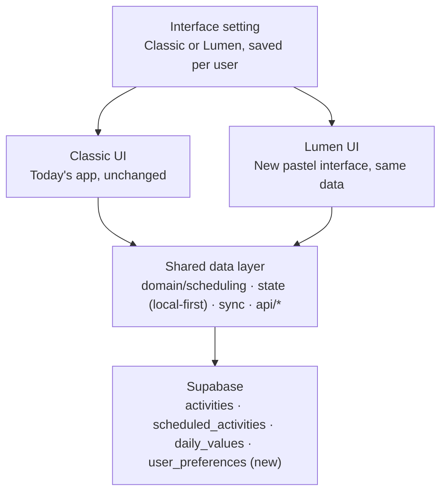

# Lumen — Product & Design Spec

> Exported from the Claude doc [Lumen — Product & Design Spec](https://claude.ai/code/artifact/45f9018a-f1b8-438d-995b-3ac5c9de5b07) on 2026-09-27. The doc is the living version; this file is a snapshot.

2026-09-27 · Avaneesh

## Summary

Lumen is a new, frontend-only interface for mindful-me: a calm, dark, pastel-coloured way to log how each half-hour of the day was spent. It runs today on sample data with no backend. The next step is to connect it to the existing Supabase backend while keeping the current app available, so each user can switch between **Classic** (today's app) and **Lumen** (this interface).

| Item | Value |
|---|---|
| Live prototype (phone) | [lumen-prototype-delta.vercel.app](https://lumen-prototype-delta.vercel.app) |
| Live prototype (Claude artifact) | [claude.ai/artifact/UfcF1Jhn5GJgAdA27qe3L7](https://claude.ai/artifact/UfcF1Jhn5GJgAdA27qe3L7) |
| Palette reference | [claude.ai/artifact/96FcLWYEgKjTquhVYQb1hn](https://claude.ai/artifact/96FcLWYEgKjTquhVYQb1hn) |
| Repository | `avaneeshz/mindful-me` |
| Branch | `claude/cool-gauss-2xm089` |
| Code | `prototypes/lumen/` (standalone Vite app, its own `package.json`) |
| Main app code | `app/src/` (untouched by Lumen so far) |
| Vercel project | `lumen-prototype` on team `avaneesh3` (separate from `mindful-me`) |
| Data | In-memory sample data, reset on every reload |
| Status | Prototype: UI complete for Today; Calendar, Insights and More are lighter |

**Using this doc in another chat:** paste the link or this text and say which section to work on. Everything a new session needs is here: what exists, the rules the design follows, where the code lives, and the agreed plan. Repo rules still apply: read `CLAUDE.md`, `WORKFLOW.md` and `.claude/agents/full-stack-engineer.md` before changing the main app or the database.

## Product

Lumen answers one question at a glance: where did today's time go? The home screen shows the whole day as two light-coloured strips, and logging a half-hour takes two taps.

### Principles

- **Calm first.** Dark navy ground, soft pastel colour, no loud primaries, motion only where it explains something.
- **Time is the interface.** The Day and Night strips are the centre of the screen; everything else supports them.
- **Minimal text.** Labels only where a picture can't carry the meaning (for example, no "Day/Night" titles above the strips).
- **Everything is customisable later.** Activities, their names and their colours are data, not code.

### The Lumen day: 6 AM to 6 AM

A Lumen day starts at 6:00 AM and ends at 6:00 AM the next calendar day. The time after midnight belongs to the evening before it, because that's how people think about a late night.

- **Day strip:** 6:00 AM – 6:00 PM (24 half-hours).
- **Night strip:** 6:00 PM – 6:00 AM (24 half-hours), with midnight in the middle.
- **Opening the app at 1:30 AM on Saturday** shows Friday, with "now" on Friday's Night strip.
- **Storage stays on calendar dates.** An entry at 01:30 on Saturday is stored under Saturday's date; only the display groups it into Friday night.
- **Slots:** 30 minutes each. In code, a Lumen day's slots are numbered 12–59 from that date's midnight (12 = 06:00, 48 = 00:00 next day, 59 = 05:30 next day).

### Screens

**Today** (the home screen, top to bottom on a phone):

1. **Top row:** date button ("Sun 27"; opens a month calendar), export, Health sync, Edit, notifications, profile. No logo or app name on phones.
2. **Metric chips:** Steps, Water, Protein as small pills (progress ring + icon + value). A dashed **+** opens Customize. The row scrolls sideways on phones once full.
3. **Day strip and Night strip:** continuous capsules with a natural-light gradient; logged time shows as solid pastel blocks. Time labels with small ticks underneath; the Night strip shows the next weekday beside 12 AM.
4. **Slot card:** the selected half-hour in small type, a **Now** marker or a **Go to now** button, any entries already logged in that half-hour, and the 3×3 activity tiles.
5. **Where today went:** a proportion bar by activity, a legend, and a timeline of logged blocks (newest first, "Show all" to expand).

**Calendar:** month heatmap (darker = more time logged) and a summary of the picked day with an **Open day** button.

**Insights:** Week / 4 weeks switch, three stats (average logged per day, most consistent activity, when the day usually starts), a stacked bar chart of time per day, and a per-activity list that filters the chart when tapped.

**More:** profile card and settings rows (Health sync, reminders, weekly reflection, export, privacy). Mostly placeholders.

### Interactions

| Where | Action | Result |
|---|---|---|
| Day/Night strip | Tap, drag, or arrow keys | Selects that half-hour; the slot card follows |
| Slot card | **Go to now** | Jumps to the current half-hour (and to today if another day is open) |
| Activity tile | Tap | Opens the activity sheet for that category |
| Activity sheet | Pick activity + duration (5/10/15/20/30 min), **Log** | Adds an entry; a toast offers **Undo** |
| Logged entry row | **✕** | Removes the entry |
| **+** button (phone) / Log activity (sidebar) / **L** key | Tap or press | Quick log: pick a category, then an activity |
| Metric chip | Tap | Sheet with a progress ring, ± steps and quick-add buttons |
| Edit (pencil) | Tap | Customize sheet: show or hide metrics and activities |
| Health sync (heart) | Tap | Simulated sync; adds steps and turns the button mint |
| Export | Tap | Download the day as CSV, or copy a summary link (simulated) |
| Date button | Tap | Month calendar; days with entries have a dot |

**Rules the logging follows:** a half-hour holds at most 30 minutes of entries; when it's full, the tiles dim and can't be tapped; durations longer than what's left are disabled in the sheet.

## Data model

Lumen's data is deliberately small and mirrors what the real backend already stores, with one gap: the backend has no per-user colour or UI-mode setting yet. Prototype types live in `prototypes/lumen/src/lib/data.ts`; the real ones in `app/src/domain/types.ts` and `supabase/migrations/`.

### Prototype shapes

| Type | Fields | Notes |
|---|---|---|
| `Category` | `id`, `label`, `short`, `icon` (Lucide), `color` (palette id), `activities[]` | 9 in the prototype; room for up to 12 on screen |
| `Activity` | `id`, `label`, `minutes` (usual duration) | Sub-options inside a category |
| `Entry` | `id`, `slot` (0–47 on its calendar date), `categoryId`, `activityId`, `minutes` (5–30) | One logged piece of a half-hour |
| `DayRecord` | `entries[]`, `metrics` { `steps`, `water`, `protein` } | Keyed by calendar date `YYYY-MM-DD` |
| `PaletteColor` | `id`, `name`, `hue`, `tone`, `shades` {5} | See Design system |

**Helpers:** `windowEntries(days, date)` returns one Lumen day (6 AM → 6 AM) with after-midnight entries renumbered 48–59. `categoryColor(id)` returns a category's palette colour and shades. `todayKey()` returns the current Lumen day (before 6 AM counts as yesterday).

### How it maps to the real backend

| Lumen concept | Real backend | Fit |
|---|---|---|
| Entry (slot + minutes) | `scheduled_activities`: `start_at`, `end_at`, `duration_minutes`, `local_date`, `start_minute`, `activity_id`, `path[]` | Backend is richer: any start minute, any length, can cross midnight. Lumen must render these, not force them into 30-minute slots |
| Category | `activities.category_id`: `sleep`, `food`, `care`, `downtime`, `movement`, `work`, `nature`, `growth`, `home` | Use the real 9 categories; Lumen's invented ones (Deep Focus, Movement…) were prototype-only |
| Activity | `activities` rows (`parent_id` for drill-downs, `icon_key`, `created_by` for user-defined) | Direct match |
| Metric chips | `daily_values` with `metric_key` in `protein`, `steps` | Water has no backend yet; hide it or add `water` in a migration |
| Entry details | quality, symptoms, notes, reflections, sleep fields on `scheduled_activities` | Not shown in Lumen yet |
| Activity colour | none | Needs a per-user colour per category (new) |
| UI mode (Classic / Lumen) | none | Needs a per-user preference (new) |
| Writes | RPCs `create_scheduled_activity`, `reschedule_scheduled_activity`, `set_scheduled_activity_status`, `set_scheduled_activity_flags`, `soft_delete_scheduled_activity`, `restore_scheduled_activity`, `list_scheduled_activities` | Reuse as-is; don't change contracts for the UI (per `CLAUDE.md`) |

**Key rule from the backend:** an activity belongs to the calendar day it starts on (`local_date`). Lumen's 6 AM–6 AM grouping is display-only and must never rewrite `local_date`.

## Design system

Lumen uses one dark theme built from CSS variables in `src/index.css`, mapped into Tailwind in `tailwind.config.js`; activity colours come from `src/lib/palette.ts`. Use these tokens and scales everywhere — never a one-off hex, size or radius.

### Typography

| Role | Font | Size / line height | Weight | Used for |
|---|---|---|---|---|
| Display | Fraunces (serif) | 40/44 (`4xl`), 32/36 (`3xl`) | 400 | Date headline on tablet/desktop, screen titles (Calendar, Insights, Settings) |
| Large number | Inter | 26/30 (`2xl`), 20/26 (`xl`) | 500 | Stats, metric sheet value |
| Title | Inter | 17/24 (`lg`) | 500–600 | Sheet titles, section titles |
| Body | Inter | 15/22 (`base`) | 400 | Default text, list rows |
| Small | Inter | 13/18 (`sm`) | 400–500 | Buttons, chips, slot time, labels |
| Caption | Inter | 12/16 (`xs`) | 400–500 | Secondary lines, section eyebrows (uppercase, +0.08em) |
| Micro | Inter | 11/14 (`2xs`), 10px | 400–600 | Strip time labels, "next day" weekday, nav labels |

Rules: headings and big numbers get slight negative tracking (−0.01 to −0.03em); all numbers use tabular figures (`.tabular`); weights stay at 400/500/600, never bold everywhere; fallbacks are `ui-sans-serif, system-ui, -apple-system` and `Georgia`.

### Spacing, radius and elevation

- **Spacing scale:** 4 · 8 · 12 · 16 · 24 · 32 · 48 px. Page gutter 16 px on phones, 24–40 px wider up. Gaps between sibling cards 16–24 px.
- **Radius:** controls 12 px (`rounded-control`), tiles 18 px (`rounded-tile`), cards 22 px (`rounded-card`), panels 28 px (`rounded-panel`), pills and strips fully round.
- **Touch targets:** at least 44 × 44 px (buttons are `h-11`).
- **Surfaces:** `.surface` = a top-to-bottom gradient from surface-2 to surface-1, a 1 px line at 8% opacity, a faint top highlight and one soft shadow. Borders appear only where they add hierarchy.
- **Elevation:** `shadow-surface` for cards, `shadow-raised` for sheets and popovers, `shadow-fab` for the + button. No heavy shadows.

### Interface colours (RGB tokens)

| Token | RGB | Hex | Job |
|---|---|---|---|
| `canvas` | 6 9 18 | #060912 | Page background (plus two faint radial glows) |
| `surface-1` | 11 16 29 | #0B101D | Card bottom, strip base |
| `surface-2` | 15 22 39 | #0F1627 | Card top |
| `surface-3` | 22 31 53 | #161F35 | Selected segment, toasts |
| `line` | 148 170 220 | — | Borders at 6–16% opacity |
| `ink` | 236 240 248 | #ECF0F8 | Primary text |
| `ink-muted` | 150 162 188 | #96A2BC | Secondary text |
| `ink-faint` | 98 110 138 | #626E8A | Tertiary text, tick labels |
| `accent` | 104 106 246 | #686AF6 | Primary action, + button, selection |
| `accent-ink` | 172 176 255 | #ACB0FF | Accent text, selection outline, focus ring |
| `mint` | 52 211 163 | #34D3A3 | Live/on-track: Now, goal reached, Health on |
| `sun` | 251 186 72 | #FBBA48 | Morning stat icon only |
| `sky` | 110 170 250 | #6EAAFA | Steps and Water chip icons |

Semantic colours (mint, accent) never double as activity colours.

### Day and Night light model

Each strip is filled with a smooth gradient that follows natural light. The stops are mirrored around the middle, so 9 AM matches 3 PM and 9 PM matches 3 AM.

| Position | 0% | 10–12% | 25% | 40% | 50% (middle) |
|---|---|---|---|---|---|
| Day (6 AM → noon) | #C9744F dawn amber | #DC9A5A | #EFC576 golden | #F7E0A6 | #FFF4D8 noon, brightest |
| Night (6 PM → midnight) | #8B84E4 evening indigo | #6865CB | #42419C | #1F2062 | #0C0D2C midnight, darkest |

The second half repeats the first in reverse. Over `surface-1`, the Day gradient is drawn at 72% opacity (dimmed so pastel blocks read as filled), Night at 92%. A 1 px white highlight at 18% sits along the top edge of the empty sky only — never over activity blocks.

### Essence line

A 2.5 px SVG line hugs the lower edge of each strip and curves up both rounded ends. Its top edge touches the capsule's edge exactly (no gap, no overlap). It uses the same light stops, with opacity 0.3 + 0.65 × intensity (day intensity peaks at noon, night intensity is lowest at midnight), fades in along each curve from the side of the capsule, and has a small downward glow (`drop-shadow(0 1.5px 2px …)`). It is drawn at the measured width so the arcs keep a true radius at every screen size.

### Soft pastel palette (activity colours)

52 colours people will be able to choose for their activities: 24 hues × 2 tones + 4 neutrals, all built in OKLCH so every colour shares one lightness and softness.

- **Pastel tone:** L 0.86, C 0.085. **Deep pastel tone:** L 0.77, C 0.095. **Neutrals:** chroma ≤ 0.02.
- **Excluded hues:** ~40–110° (the Day strip's amber/yellow) and ~255–300° (the Night strip's indigo/violet), so logged time never blends into empty time. Every colour was checked against both skies.
- **Five shades per colour:** `highlight` (text, outlines), `base` (strip blocks, charts, swatches), `hover` (pressed/hover), `surface` (selected tile, tinted panel), `bubble` (circle behind an activity icon).

| Hue | Pastel | Deep pastel |
|---|---|---|
| 5° | Rose #FFBAC9 | Rosewood #E89BAC |
| 15° | Coral #FFBBBF | Clay #EA9BA1 |
| 25° | Salmon #FFBCB5 | Terracotta #EB9C96 |
| 35° | Peach #FFBEAC | Copper #EA9E8B |
| 115° | Lime #CFD898 | Leaf #B2BC74 |
| 125° | Pistachio #C4DB9E | Sage #A6BF7B |
| 135° | Clover #B9DEA6 | Basil #9AC285 |
| 145° | Spring #AFE0AF | Fern #8EC58F |
| 155° | Jade #A4E2B9 | Emerald #82C79A |
| 165° | Mint #9BE3C3 | Pine #76C8A5 |
| 175° | Seafoam #93E4CE | Lagoon #6DC8B1 |
| 185° | Aqua #8EE4D8 | Teal #65C8BC |
| 195° | Glacier #8BE3E2 | Ocean #61C7C7 |
| 205° | Sky #8BE2EB | Cerulean #61C6D1 |
| 215° | Ice #8DE0F4 | Harbor #65C4DA |
| 225° | Powder #92DDFB | Denim #6CC1E2 |
| 235° | Cornflower #99DBFF | Azure #75BEE8 |
| 245° | Periwinkle #A2D8FF | Cobalt #7FBBED |
| 305° | Orchid #DEC3FE | Amethyst #C2A5E5 |
| 315° | Mauve #E6C1F8 | Plum #CBA2DE |
| 325° | Fuchsia #EEBEF0 | Magenta #D39FD6 |
| 335° | Peony #F5BCE7 | Berry #DA9DCC |
| 345° | Bubblegum #FABBDE | Cerise #E09CC2 |
| 355° | Blossom #FFBAD4 | Raspberry #E59BB7 |
| Neutral | Cloud #DBDEE2 · Silver #B8BEC5 | Slate #8F9AA4 · Stone #B0AAA3 |

**Current defaults and their shades:**

| Activity (prototype) | Colour | highlight | base | hover | surface | bubble |
|---|---|---|---|---|---|---|
| Deep Focus | Sky | #CFF3F7 | #8BE2EB | #8DF1FC | #1E3E41 | #112B2E |
| Movement | Coral | #FFE1E3 | #FFBBBF | #FFC5CA | #4A3031 | #352021 |
| Meals & Fuel | Pistachio | #E5F0D5 | #C4DB9E | #CFEAA4 | #333C25 | #232918 |
| Rest & Recover | Lagoon | #B2D7CC | #6DC8B1 | #6FD7BD | #1D3F37 | #112C25 |
| Friends & Family | Blossom | #FFE1EC | #FFBAD4 | #FFC4E1 | #483039 | #332027 |
| Make & Create | Mauve | #F5E4FD | #E6C1F8 | #F6CBFF | #3F3246 | #2C2231 |
| Read & Learn | Azure | #B4D3E6 | #75BEE8 | #79CCFB | #213C4B | #132936 |
| Time Outdoors | Fern | #BDD6BD | #8EC58F | #96D397 | #2A3E2A | #1B2B1B |
| Life Admin | Silver | #D5D8DB | #B8BEC5 | #C0CCD9 | #36383B | #252729 |

All values are generated — change the recipe and regenerate rather than hand-editing a hex. A browsable version with previews is in `prototypes/lumen/docs/pastel-palette.html`.

### Motion

150–300 ms, easing `cubic-bezier(0.22, 1, 0.36, 1)`. Used for sheet and popover entry, the strip selection window, number changes, tile entrance (25 ms stagger) and progress fills. Everything respects `prefers-reduced-motion` via Motion's `MotionConfig`.

## Components and patterns

Every screen is built from a small set of shared primitives; before adding a component, reuse or extend one of these (a rule from `CLAUDE.md`).

### Shared primitives (`src/components/ui/`)

| Component | What it is | Notes |
|---|---|---|
| `Button` | Variants `quiet` (default), `ghost`, `primary`, `active`; sizes `icon` (44 px circle), `md`, `lg` | Presses scale to 97%; disabled at 40% opacity |
| `Sheet` | Bottom sheet on phones, centred dialog from 768 px | Radix Dialog + Motion; title, description, optional leading icon, sticky footer |
| `Popover` | Floating panel for menus (date, export, notifications, profile) | Radix Popover; closes on select |
| `MenuItem` | 44 px row with icon, label, hint | Used inside popovers |
| `IconBubble` | Round icon badge | `hue` for UI colours, or `color` (palette id) for activities: bubble shade behind, base shade icon |
| `ProgressRing` | SVG ring | Mint when the goal is reached |
| `ProgressBar` | Thin bar |  |
| `Segmented` | Pill-shaped option switch with a sliding thumb | Durations, Week/4 weeks |
| `Switch` | Toggle | Customize, settings |
| `EmptyState`, `SectionTitle` | Empty and heading patterns |  |
| `Toaster` | Bottom toast stack, optional action | "Logged 30 min · Reading" + Undo |

### Today's building blocks (`src/components/today/`)

- **Header** (`header.tsx`): phone = one row (date button, export, Health, Edit, notifications, profile); tablet/desktop = greeting + serif date headline, account buttons, and a toolbar row with previous/next day.
- **Metric chips** (`metrics.tsx`): pills that size to their content; ring shows goal progress, turns mint with a tick at 100%; label hidden on phones; dashed **+** opens Customize.
- **Day and Night strips** (`day-strips.tsx`): 40 px capsules, the light gradient, activity spans merged when back-to-back and the same category, a dimmed veil over time not yet reached, a selection window (accent outline), a mint "now" line, the essence line, and time labels with ticks. Keyboard: arrows, Home, End.
- **Slot card** (`slot-card.tsx`): small time label, **Now** (mint, pulsing dot) or **Go to now**, logged-entry rows with remove, and a 3-column tile grid. Tiles show icon bubble, name, today's total for that category and a chevron; the last-opened tile gets an accent outline.
- **Activity sheet** (`activity-sheet.tsx`): one component for both entry points — a category tile opens straight to activities; the + button opens a category list first, with a back arrow.
- **Customize sheet**, **Where today went** (`day-flow.tsx`), **Calendar**, **Insights**, **More** screens.

### UX states each component handles

| State | How it looks |
|---|---|
| Empty | Friendly `EmptyState` ("A blank page"), empty strip shows only the sky |
| Full half-hour | Tiles dim to 40% and can't be tapped |
| Disabled | 40% opacity, no pointer |
| Hover / pressed | Slightly lighter surface; press scales to 97% |
| Focus | 2 px `accent-ink` outline with offset |
| Selected | Accent outline (strip window, tiles, radio rows) |
| Live | Mint (Now, goal reached, Health on) |
| Loading | Spinner in the Health button while syncing |
| Success | Toast, with Undo when the action can be undone |
| Error | Not built yet — needed once the backend is connected |

### Patterns to keep

- One accent colour for actions; mint only for "live / done"; pastels only for activities.
- Activity colours are applied with inline styles from palette shades, so user-chosen colours work without new CSS.
- Labels are short; screen-reader text carries what the visuals imply (for example the strips' sections have full `aria-label`s).
- No emoji as icons; Lucide icons at stroke 1.8–2.

## Responsive rules

Lumen has three layouts, switched at 768 px, 1024 px and 1280 px; nothing may ever scroll sideways (checked at 360, 390, 1180 and 1440 px).

| Width | Navigation | Today layout | Other changes |
|---|---|---|---|
| Under 768 px (phones) | Bottom bar: Today, Calendar, raised **+**, Insights, More | One column: top row → chips → strips → slot card → Where today went | Sheets slide up from the bottom; header is a single row; date shows "Sun 27"; Edit is icon-only; metric chips hide labels and scroll sideways |
| Under 380 px | Same | Same | Calendar icon inside the date button is hidden; tile names drop to 13 px |
| 768–1023 px (tablet portrait) | Icon rail on the left with a + button | One column | Greeting + serif date headline; separate toolbar row; sheets become centred dialogs |
| 1024–1279 px (tablet landscape) | Icon rail | Two columns: chips, strips and Where today went on the left; slot card on the right, pinned while scrolling | Previous/next day arrows appear beside the date |
| 1280 px and up (desktop) | Full sidebar: logo, Log activity (L), nav, a weekly tip | Two columns as above | Metric chips show labels and wrap |

Rules: the page gutter is 16 px on phones; toasts sit above the bottom bar on phones and at the bottom from 768 px; all safe-area insets (iPhone notch and home bar) are respected.

## Code map, build and deployment

Lumen is a standalone Vite + React 19 + TypeScript app in `prototypes/lumen/`, separate from the main app and deployed as its own Vercel project.

### Stack

React 19, Vite 6, TypeScript 5.7, Tailwind CSS 3.4, Motion 13 (`motion/react`), Radix Dialog and Popover, Lucide icons, `clsx` + `tailwind-merge`. No router (tabs are state), no backend client yet.

### Files

| Path | What's in it |
|---|---|
| `src/main.tsx` | App root, tab switching, quick-log sheet, **L** shortcut, `MotionConfig` |
| `src/index.css` | Colour tokens, `.surface`, `.tabular`, base styles |
| `tailwind.config.js` | Maps tokens to Tailwind; font sizes, radii, shadows |
| `src/lib/store.tsx` | All state (selected date and slot, entries, metrics, settings, toasts) and actions |
| `src/lib/data.ts` | Types, categories, metrics, seeded sample history, `windowEntries`, `categoryColor` |
| `src/lib/palette.ts` | The 52-colour Soft pastel palette with shades |
| `src/lib/utils.ts` | Time helpers, 6 AM–6 AM day helpers, `cn` |
| `src/components/shell.tsx` | Sidebar, rail, bottom bar, + button |
| `src/components/ui/` | Shared primitives (see Components) |
| `src/components/today/` | Header, metrics, day-strips, slot-card, activity-sheet, customize-sheet, day-flow |
| `src/screens/` | today, calendar, insights, more |
| `docs/pastel-palette.html` | Browsable palette reference |
| `README.md` | Short overview and run commands |

### Run and build

```bash
cd prototypes/lumen
npm install
npm run dev        # http://localhost:5173
npm run build      # typecheck + production build
```

### Deployment

| Target | How it updates |
|---|---|
| Vercel project `lumen-prototype` (team `avaneesh3`), root `prototypes/lumen`, framework Vite, output `dist` | Not linked to GitHub auto-deploys: redeploy after each push (Vercel dashboard → Redeploy, or an API deployment from branch `claude/cool-gauss-2xm089`). To auto-deploy, connect the project to the repo under Settings → Git |
| Claude artifact | Build with `npx vite build --base ./`, publish `dist/index.html` content plus `assets/*` as the artifact's files |

The main `mindful-me` Vercel project and its Supabase projects are untouched by Lumen.

## Plan: real backend with a Classic / Lumen switch

Recommendation: bring Lumen into the main app as a second interface over the same data layer, and let each user pick it in settings. Nothing about the data, the backend contracts or the Classic screens changes for people who stay on Classic.

### Naming

| Option | Old UI | New UI | Why |
|---|---|---|---|
| **Recommended** | **Classic** | **Lumen** | Lumen is already this interface's name and says "light", which matches the day/night strips |
| Alternative | Classic | Softlight | Describes the pastel look directly |
| Alternative | Classic | Dusk | Calm, evening feel; shorter |

The setting lives in **More → Appearance → Interface: Classic / Lumen**, with a one-time "Try the new look" card for existing users.

### Architecture



*Two interfaces share one data layer and one backend.*

Both interfaces read and write through the same modules the main app already has (`app/src/domain`, `app/src/state`, `app/src/api`), so there is one source of truth, one sync path and one set of RPCs. Only the screens differ.

### Phases

1. **Decide the open items** (below): names, category colours, what to do with Water, how Lumen shows notes and quality.
2. **Move Lumen into the main app** as a feature folder (for example `app/src/ui/lumen/`), still on sample data, behind the Interface setting (stored locally at first). Classic stays the default.
3. **Read real data.** Replace Lumen's sample store with an adapter over the existing state: categories and activities from the catalog, entries from `scheduled_activities` (by `start_at` and `duration_minutes`), metrics from `daily_values` (steps, protein).
4. **Write real data** only through the shared scheduling module (`computeCandidateSchedule` → `validateSchedule` → `commitSchedule`) and the existing RPCs. A tile tap creates an activity starting at the selected half-hour (or right after what's already logged in it), with the chosen duration.
5. **Save preferences per user.** Add one additive migration for a `user_preferences` table (`user_id`, `ui_mode`, `category_colors` jsonb, `updated_at`) with row-level security; apply to the test project first, per `WORKFLOW.md`. Until then, keep them on the device.
6. **Fill parity gaps** that Classic users rely on (notes, quality, symptoms, reflections, sleep fields, supplements, header buttons): either add them to Lumen or link to the Classic screen for that entry.
7. **Release** through `develop` → `main` with the Interface setting defaulting to Classic, then invite users to try Lumen.

### Proposed colours for the real categories

| Backend category | Suggested palette colour |
|---|---|
| `sleep` | Periwinkle |
| `food` | Pistachio |
| `care` | Aqua |
| `downtime` | Mauve |
| `movement` | Coral |
| `work` | Sky |
| `nature` | Fern |
| `growth` | Peony |
| `home` | Stone |

### Rules to respect

- Don't change API contracts or business behaviour to suit the UI (`CLAUDE.md`).
- An activity belongs to the calendar day it starts on (`local_date`); Lumen's 6 AM–6 AM view only groups it.
- Durations are arbitrary minutes and may cross midnight; the strips must draw them as they are, not snap them to 30-minute slots.
- Every write lands locally first and syncs in the background; the UI never waits on the network.
- Schema changes are additive and go to the test Supabase project before production.

### Risks

| Risk | Effect | Mitigation |
|---|---|---|
| Classic features missing in Lumen | Users lose notes, quality, reflections | Link to Classic for those entries until Lumen has them |
| Two interfaces to maintain | Double UI work for every feature | Keep all logic in the shared layer; screens stay thin |
| Midnight-crossing entries | An entry appears on both strips | Draw it as two pieces, stored as one row |
| Night view vs `local_date` | Confusing day totals | Totals follow the 6 AM–6 AM view; storage never changes |
| Bundle size | Two UIs load | Load each interface's code only when it's chosen |

## Open decisions and decision log

Five decisions are needed before the backend work starts; everything below them is already settled.

### Open decisions

- Final names: Classic + Lumen (recommended), or another name for the new interface
- Colours for the 9 real backend categories (proposal in the Plan)
- Water chip: add `water` to `daily_values`, or hide Water until then
- Notes, quality, symptoms and reflections in Lumen: build them in, or link to Classic for now
- Colour picker UI: where people change an activity's colour (activity sheet, Customize, or both)

### Decisions made

| Date | Decision |
|---|---|
| 27 Sep 2026 | Slot card shows only a small time label, Now / Go to now, logged entries and the tiles |
| 27 Sep 2026 | Phone header is one row: date, export, Health, Edit, notifications, profile; no logo or tagline |
| 27 Sep 2026 | Activity blocks are one flat colour; highlight sits under them; essence line touches the strip from outside |
| 27 Sep 2026 | Soft pastel palette chosen: 52 colours, 5 shades each; activities store a palette id so users can pick later |
| 27 Sep 2026 | Activity colours avoid the strips' amber and indigo families |
| 27 Sep 2026 | Strips sit on the page (no cards, no titles); colours mirror around 12; next-day tag reduced to a small weekday |
| 27 Sep 2026 | Strips redesigned as glass capsules with a natural-light gradient and a 2.5 px essence line; no sun/moon icons |
| 27 Sep 2026 | Metric chips shrink to their content, with a + to add more |
| 26 Sep 2026 | Lumen deployed to its own Vercel project for phone testing |
| 26 Sep 2026 | Wake-up and wind-down removed; Day (6 AM–6 PM) and Night (6 PM–6 AM) strips added; a Lumen day runs 6 AM–6 AM |
| 25 Sep 2026 | Lumen built as a standalone prototype, independent of the Classic app |
